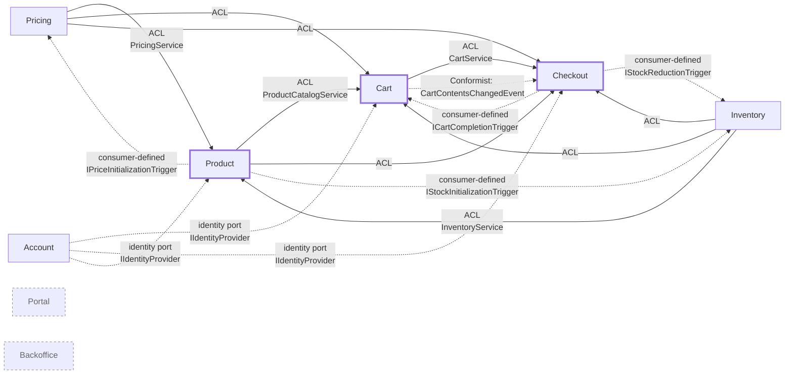

# Context Map

Strategic view of the bounded contexts in this reference implementation and how
they relate: relationship patterns in DDD terms (Partnership, Anti-Corruption
Layer, Conformist, Separate Ways) and the subdomain type of each context.
**Hand-maintained** by the `/context-map` skill.

The structural truth is [`architecture/context-map.md`](architecture/context-map.md):
that file is generated by the architecture test from the `[BoundedContext]`,
`[Upstream]`, `[ExternalUpstream]` and `[Partnership]` attributes and fails the
build when it is stale. Where the two differ, the generated one is right about
*which* dependencies exist; this one adds the strategic reading — subdomain types
and the reason a relationship has the shape it has — that no attribute carries.

## Bounded Contexts

| Context | Responsibility | Subdomain |
|---|---|---|
| `Product` | Product Catalog: master data, categories, composite-article aggregation | Core |
| `Pricing` | Price determination and price-change tracking; publishes `Api` | Supporting |
| `Inventory` | Stock level management and availability tracking | Supporting |
| `Cart` | Shopping cart for guest and authenticated users | Core |
| `Checkout` | Checkout process, payment orchestration, order confirmation | Core |
| `Account` | Registered accounts, credentials, profile and authenticated sessions | Supporting |
| `Portal` | Web portal, UI composition, cross-context views | Generic (UI) |
| `Backoffice` | Operating this application — event publication log, operator views | Generic (Ops) |

The subdomain classification drives pattern choice and rule-set strictness per
context — see
[ADR-003: Pattern selection per context](architecture/adr/adr-003-pattern-selection-per-context.md).
(In this sample all contexts use the rich domain-model style for didactic
reasons; the ADR documents what a production system would relax.)

Shared Kernel: `src/DcaShop.SharedKernel/` holds the universal value objects
(`ProductId`, `Money`, `UserId`, …) and the composable specification pattern; the
architectural markers come from `DomainCentric.BuildingBlocks`. Deliberately kept
small; its one port is the identity port
`Application/Shared/IIdentityProvider.cs`, which Account implements.

## Relationships

| Upstream | Downstream | Pattern | Realised via |
|---|---|---|---|
| `Pricing` | `Product` | Anti-Corruption Layer (`Api`) | `Pricing.Api.PricingService` → `Product/Adapter/Outgoing/Pricing/PricingDataAdapter` |
| `Inventory` | `Product` | Anti-Corruption Layer (`Api`) | `Inventory.Api.InventoryService` → `Product/Adapter/Outgoing/Inventory/InventoryStockDataAdapter` |
| `Product` | `Cart` | Anti-Corruption Layer (`Api`) | `Product.Api.ProductCatalogService` → `Cart/Adapter/Outgoing/Product/CompositeArticleDataAdapter` |
| `Pricing` | `Cart` | Anti-Corruption Layer (`Api`) | `Pricing.Api.PricingService` (via `CompositeArticleDataAdapter`) |
| `Inventory` | `Cart` | Anti-Corruption Layer (`Api`) | `Inventory.Api.InventoryService` (via `CompositeArticleDataAdapter`) |
| `Product` | `Checkout` | Anti-Corruption Layer (`Api`) | `Product.Api.ProductCatalogService` → `Checkout/Adapter/Outgoing/Product/CompositeCheckoutArticleDataAdapter` |
| `Pricing` | `Checkout` | Anti-Corruption Layer (`Api`) | `Pricing.Api.PricingService` |
| `Inventory` | `Checkout` | Anti-Corruption Layer (`Api`) | `Inventory.Api.InventoryService` |
| `Cart` | `Checkout` | Anti-Corruption Layer (`Api`) | `Cart.Api.CartService` → `Checkout/Adapter/Outgoing/Cart/CartDataAdapter` |
| `Cart` | `Checkout` | Conformist (`Events`) | `Cart.Events.CartContentsChangedEvent` → `Checkout/Adapter/Incoming/Event/CartSync/CartChangeEventConsumer` |
| `Checkout` | `Cart` | Conformist — consumer-defined contract | `Checkout.Events.CheckoutConfirmedEvent` implements `Cart.Events.ICartCompletionTrigger`; consumer in `Cart/Adapter/Incoming/Event/CartCheckout/CartCompletionEventConsumer` |
| `Checkout` | `Inventory` | Conformist — consumer-defined contract | `Checkout.Events.CheckoutConfirmedEvent` implements `Inventory.Events.IStockReductionTrigger`; consumer in `Inventory/Adapter/Incoming/Event/StockReductionEventConsumer` |
| `Product` | `Pricing` | Conformist — consumer-defined contract | `Product.Events.ProductCreatedEvent` implements `Pricing.Events.IPriceInitializationTrigger`; consumer in `Pricing/Adapter/Incoming/Event/PriceInitializationEventConsumer` |
| `Product` | `Inventory` | Conformist — consumer-defined contract | `Product.Events.ProductCreatedEvent` implements `Inventory.Events.IStockInitializationTrigger`; consumer in `Inventory/Adapter/Incoming/Event/StockInitializationEventConsumer` |
| Payment Service Provider | `Checkout` | Anti-Corruption Layer (external, REST) | declared as `[ExternalUpstream]` on `CheckoutContext`, behind the caller-owned `IPaymentProviderRegistry` port; the sample ships `Checkout/Adapter/Outgoing/Payment/InMemoryPaymentProviderRegistry` and `MockPaymentProvider` in place of a real gateway |
| `Account` | `Cart`, `Checkout`, `Product` | Supplier via the shared kernel's identity port | `SharedKernel.Application.Shared.IIdentityProvider` is implemented only in `Account/Adapter/Outgoing/Security/HttpContextIdentityProvider`; the incoming adapters of Cart, Checkout and Product resolve the caller through that port and hand the customer to their use cases as a command or query field. The dependency is invisible to the declared map — it runs through the shared kernel — which is why it is stated here. Account itself depends on no other context |
| `Portal` | (all) | Separate Ways | Aggregation happens in the UI; no cross-context references |
| `Backoffice` | (all) | Separate Ways | Reads the event publication log only; negotiates no contract |

Declared partnerships (`[Partnership]` on both sides, symmetric): `Cart` ↔
`Checkout`, `Checkout` ↔ `Inventory`, `Inventory` ↔ `Product`, `Pricing` ↔
`Product`. A partnership records that the two contexts evolve their contract
together; it grants no dependency permission, so each pair also carries the
`[Upstream]` declaration that names the actual direction and channel.

### Pattern notes

- **Anti-Corruption Layer:** The upstream context exposes a narrow `Api`
  namespace. The downstream context consumes it only in its *outgoing-adapter*
  layer and translates the API types into its own domain model, so the upstream
  model never reaches its invariants.
- **Conformist:** Integration events live in `<Context>/Events/` and are consumed
  as published, in `Adapter/Incoming/Event/`.
- **Consumer-defined contract (a variant of Conformist):** The *consuming*
  context defines the event interface (e.g. `ICartCompletionTrigger`); the
  *publishing* context implements that interface on its integration event
  (`CheckoutConfirmedEvent`). This removes any compile-time dependency from the
  consumer to the publisher.
- **Separate Ways:** No direct code or event dependencies.

## Diagram

**Legend:** Solid arrow = synchronous `Api` call; dotted arrow = asynchronous
integration event. Thick-border nodes = core subdomain; dashed-border nodes =
Separate Ways (no compile-time cross-context dependency). Partnerships and the
external payment provider are in the generated map.

## Notable design choices

1. **Every `Api` consumption is translated.** Each downstream context maps
   foreign API types into its own domain types inside the adapter layer — the
   domain code never sees types from another context's `Api`.
2. **The one external system is an ACL by declaration.** The payment service
   provider is the only `[ExternalUpstream]`; its adapter is where a real PSP
   would be integrated.
3. **Consumer-defined contracts** are preferred whenever the publisher sits
   architecturally *below* the consumer — they prevent a backwards dependency
   without a shared schema module.
4. **`Backoffice` is a bounded context of a generic subdomain.** Its language is
   its own — an *event publication* is a dispatched domain event with a
   completion status, a concept no business context uses. It reads what others
   have published and negotiates no contract, hence Separate Ways.
5. **`Portal` composes in the UI**, not in C#. There is no backend aggregation
   service that joins multiple contexts.

## Maintenance

Run `/context-map update` whenever:

- a new bounded context is introduced,
- a new `Api` type or integration event is added,
- an `[Upstream]`, `[ExternalUpstream]` or `[Partnership]` declaration changes,
- a synchronous/asynchronous switch takes place (an `Api` call becomes an event).
