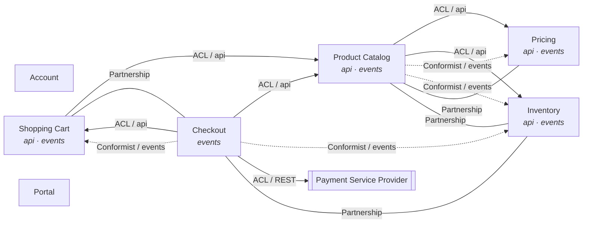

# DcaShop Context Map

> **Generated file — do not edit.** Derived from the `[BoundedContext]`, `[Upstream]`,
> `[ExternalUpstream]`, and `[Partnership]` context attributes by
> `ContextMapRenderer`. After changing a declaration, regenerate and commit this file.

Each side declares only what it controls: the downstream declares its consumed upstreams
(`[Upstream]`: translation strategy and channel), the upstream publishes its contract
(`api`/`events` namespaces, `[OpenHostService]`), and partnerships are declared
symmetrically on both contexts. Organizational patterns such as Customer–Supplier are not
machine-classified; Separate Ways is the absence of any declaration. External systems
appear via `[ExternalUpstream]` on their consuming context — the model dependency always
points to the external system, regardless of who initiates the exchange. Non-context
modules and the shared kernel are intentionally not part of this map.

## Bounded Contexts

| Module | Name | Description | Published interfaces |
|---|---|---|---|
| Account | Account | Registered accounts, credentials, profile and authenticated sessions | — |
| Cart | Shopping Cart | Cart management, item additions/removals, and cart lifecycle | api, events |
| Checkout | Checkout | Checkout process, order placement, and payment orchestration | events |
| Inventory | Inventory | Stock level management and availability tracking | api, events |
| Portal | Portal | Web portal, user interface composition, and cross-context views | — |
| Pricing | Pricing | Product pricing management and price change tracking | api, events |
| Product | Product Catalog | Product management and catalog browsing | api, events |

## Diagram

Arrows point from downstream to upstream (dependency direction, never call direction).
Solid arrows are synchronous consumption (`api` / external `outbound`), dotted arrows are
asynchronous consumption (`events` / external `inbound`), plain lines are partnerships.
Double-framed nodes are external systems. Node badges list published interfaces.
Edges labeled `planned` are declared intent without a code dependency yet.

## Upstream relationships

| Downstream | Upstream | Channel | Translation | Status | Rationale |
|---|---|---|---|---|---|
| Cart | Product | api | ACL | implemented | Cart works with its own article snapshot; the catalog model must not leak into cart invariants |
| Checkout | Product | api | ACL | implemented | Product data is translated into checkout's own article types |
| Checkout | Cart | api | ACL | implemented | Cart snapshots are translated into checkout's own CartData |
| Checkout | Cart | events | Conformist | implemented | CheckoutConfirmedEvent implements cart's consumer-defined ICartCompletionTrigger contract as-is; cart's CartContentsChangedEvent is consumed as published |
| Checkout | Inventory | events | Conformist | implemented | CheckoutConfirmedEvent implements inventory's consumer-defined IStockReductionTrigger contract as-is |
| Product | Pricing | api | ACL | implemented | The catalog shows a price but does not own it; the pricing model is translated into the catalog's own article view |
| Product | Inventory | api | ACL | implemented | Availability is an inventory statement; the catalog translates it into its own article view |
| Product | Pricing | events | Conformist | implemented | ProductCreatedEvent implements pricing's consumer-defined IPriceInitializationTrigger contract as-is |
| Product | Inventory | events | Conformist | implemented | ProductCreatedEvent implements inventory's consumer-defined IStockInitializationTrigger contract as-is |

## External systems

| Consumer | External system | Interaction | Protocol | Exchanges | Translation | Status | Rationale |
|---|---|---|---|---|---|---|---|
| Checkout | Payment Service Provider | outbound | REST | payment operations (initiate, confirm, refund) | ACL | implemented | Behind the caller-owned IPaymentProviderRegistry port; the sample ships an in-memory registry in place of a real gateway |

## Partnerships

| Contexts | Rationale |
|---|---|
| Cart ↔ Checkout | Cart owns the consumer-defined ICartCompletionTrigger contract that checkout events implement; both contexts evolve it together — Checkout implements cart's consumer-defined ICartCompletionTrigger contract; both contexts evolve it together |
| Checkout ↔ Inventory | Checkout implements inventory's consumer-defined IStockReductionTrigger contract; both contexts evolve it together — Inventory owns the consumer-defined IStockReductionTrigger contract that checkout events implement; both contexts evolve it together |
| Inventory ↔ Product | Inventory owns the consumer-defined IStockInitializationTrigger contract that catalog events implement; both contexts evolve it together — The catalog implements inventory's consumer-defined IStockInitializationTrigger contract; both contexts evolve it together |
| Pricing ↔ Product | Pricing owns the consumer-defined IPriceInitializationTrigger contract that catalog events implement; both contexts evolve it together — The catalog implements pricing's consumer-defined IPriceInitializationTrigger contract; both contexts evolve it together |
