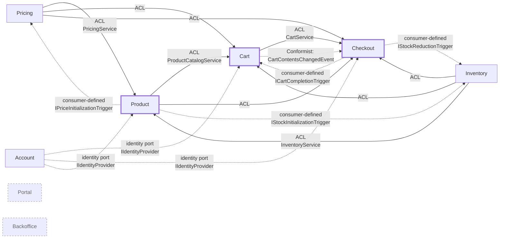

# Context Map — as designed

The designed, strategic view of the bounded contexts in this reference implementation and how
they relate: the organisational relationship pattern in DDD terms (Partnership,
Customer/Supplier, Separate Ways) beside the translation each context declares,
and the subdomain type of each context.
**Hand-maintained** by the `/context-map` skill.

The map as built is [`docs/architecture/context-map.md`](../docs/architecture/context-map.md):
that file is generated by the architecture test from the `[BoundedContext]`,
`[Upstream]`, `[ExternalUpstream]` and `[Partnership]` attributes, and fails the build when it is stale.
The two answer different questions — the generated one which dependencies *exist*, this one which
were *decided*, with the pattern names, the subdomain types and the reasons no declaration carries.
A difference between them is a finding: the code follows the decision, or the decision is taken and
recorded here.

## Bounded Contexts

| Context | Responsibility | Subdomain |
|---|---|---|
| `Product` | Product Catalog: master data, categories, composite-article aggregation | Core |
| `Pricing` | Price determination and price-change tracking; publishes `Api` | Supporting |
| `Inventory` | Stock level management and availability tracking | Supporting |
| `Cart` | Shopping cart for guest and authenticated users | Core |
| `Checkout` | Checkout process, payment orchestration, order confirmation | Core |
| `Account` | Registered accounts, credentials, profile and authenticated sessions | Supporting |
| `Portal` | Web portal, UI composition, cross-context views | Generic (UI) |
| `Backoffice` | Operating this application — event publication log, operator views | Generic (Ops) |

The subdomain classification drives pattern choice and rule-set strictness per
context — see
[ADR-003: Pattern selection per context](../docs/architecture/adr/adr-003-pattern-selection-per-context.md).
(In this sample all contexts use the rich domain-model style for didactic
reasons; the ADR documents what a production system would relax.)

Shared Kernel: `src/DcaShop.SharedKernel/` holds the universal value objects
(`ProductId`, `Money`, `UserId`, …) and the composable specification pattern; the
architectural markers come from `DomainCentric.BuildingBlocks`. Deliberately kept
small; its one port is the identity port
`Application/Shared/IIdentityProvider.cs`, which Account implements.

## Relationships

Three axes, and only the first two are in the code. **Declared** is what
`[Upstream(Translation, Consumes)]` states: how *this* context protects its model —
`ACL` or `Conformist`. **Published by the upstream** is what `[OpenHostService]` and
the `Api`/`Events` namespaces state. **Organisational** is the team relationship,
which no attribute carries and which therefore lives only here. A relationship is
normally all three at once: the catalog consumes pricing through an open host
service, translates it with an ACL, and the two teams work as Customer/Supplier —
those are three answers, not three competing names.

| Upstream | Downstream | Declared (`Translation` / `Consumes`) | Organisational | Realised via |
|---|---|---|---|---|
| `Pricing` | `Product` | ACL / Api | Partnership | `Pricing.Api.PricingService` → `Product/Adapter/Outgoing/Pricing/PricingDataAdapter` |
| `Inventory` | `Product` | ACL / Api | Partnership | `Inventory.Api.InventoryService` → `Product/Adapter/Outgoing/Inventory/InventoryStockDataAdapter` |
| `Product` | `Cart` | ACL / Api | Customer/Supplier | `Product.Api.ProductCatalogService` → `Cart/Adapter/Outgoing/Product/CompositeArticleDataAdapter` |
| `Pricing` | `Cart` | ACL / Api | Customer/Supplier | `Pricing.Api.PricingService` (via `CompositeArticleDataAdapter`) |
| `Inventory` | `Cart` | ACL / Api | Customer/Supplier | `Inventory.Api.InventoryService` (via `CompositeArticleDataAdapter`) |
| `Product` | `Checkout` | ACL / Api | Customer/Supplier | `Product.Api.ProductCatalogService` → `Checkout/Adapter/Outgoing/Product/CompositeCheckoutArticleDataAdapter` |
| `Pricing` | `Checkout` | ACL / Api | Customer/Supplier | `Pricing.Api.PricingService` |
| `Inventory` | `Checkout` | ACL / Api | Partnership | `Inventory.Api.InventoryService` |
| `Cart` | `Checkout` | ACL / Api | Partnership | `Cart.Api.CartService` → `Checkout/Adapter/Outgoing/Cart/CartDataAdapter` |
| `Cart` | `Checkout` | Conformist / Events | Partnership | `Cart.Events.CartContentsChangedEvent` → `Checkout/Adapter/Incoming/Event/CartSync/CartChangeEventConsumer` |
| `Checkout` | `Cart` | Conformist / Events | Partnership | `Checkout.Events.CheckoutConfirmedEvent` implements `Cart.Events.ICartCompletionTrigger`; consumer in `Cart/Adapter/Incoming/Event/CartCheckout/CartCompletionEventConsumer` |
| `Checkout` | `Inventory` | Conformist / Events | Partnership | `Checkout.Events.CheckoutConfirmedEvent` implements `Inventory.Events.IStockReductionTrigger`; consumer in `Inventory/Adapter/Incoming/Event/StockReductionEventConsumer` |
| `Product` | `Pricing` | Conformist / Events | Partnership | `Product.Events.ProductCreatedEvent` implements `Pricing.Events.IPriceInitializationTrigger`; consumer in `Pricing/Adapter/Incoming/Event/PriceInitializationEventConsumer` |
| `Product` | `Inventory` | Conformist / Events | Partnership | `Product.Events.ProductCreatedEvent` implements `Inventory.Events.IStockInitializationTrigger`; consumer in `Inventory/Adapter/Incoming/Event/StockInitializationEventConsumer` |
| Payment Service Provider | `Checkout` | ACL / REST (outbound) | Conformist to the provider's contract | `[ExternalUpstream]` on `CheckoutContext`, behind the caller-owned `IPaymentProviderRegistry` port; `src/DcaShop.Checkout/Adapter/Outgoing/Payment/RestPaymentProvider.cs` translates the provider's REST contract (`POST /payments`: `201` authorizes, `402` refuses, no answer in time counts as unavailable) when `Checkout:PaymentProvider:BaseUrl` is configured; without it `src/DcaShop.Checkout/Adapter/Outgoing/Payment/MockPaymentProvider.cs`, the in-sample stand-in, takes payments |
| `Account` | `Cart`, `Checkout`, `Product` | not declared — the dependency runs through the shared kernel | Supplier of identity | `SharedKernel.Application.Shared.IIdentityProvider` is implemented only in `Account/Adapter/Outgoing/Security/HttpContextIdentityProvider`; the incoming adapters of Cart, Checkout and Product resolve the caller through that port and hand the customer to their use cases as a command or query field. Invisible to the declared map, which is why it is stated here. Account itself depends on no other context |
| `Portal` | (all) | not declared | Separate Ways | Composition happens in the UI; no cross-context references |
| `Backoffice` | (all) | not declared | Separate Ways | Reads the event publication log only; negotiates no contract |

Every upstream in the first block publishes through `[OpenHostService]` on its `Api`
type; the event contracts are the published language of their context. Partnerships
are the pairs that declare `[Partnership]` on both sides: `Cart` ↔ `Checkout`,
`Checkout` ↔ `Inventory`, `Inventory` ↔ `Product`, `Pricing` ↔ `Product` — each of
them owns a consumer-defined event contract the other implements, which is why the
two evolve it together.

### Pattern notes

- **Open Host Service (upstream) + ACL (downstream):** The upstream context
  exposes a narrow `Api` namespace carrying `[OpenHostService]`. The downstream
  consumes it only in its *outgoing-adapter* layer and translates the API types
  into its own domain model, so the upstream model never reaches its invariants —
  that translation is what `Translation.AntiCorruptionLayer` declares.
- **Published Language (upstream) + Conformist (downstream):** Integration events
  live in `<Context>/Events/` and are consumed as published — declared as
  `Translation.Conformist` — with consumers in `Adapter/Incoming/Event/`.
- **Consumer-defined contract (a variant of Conformist):** The *consuming*
  context defines the event interface (e.g. `ICartCompletionTrigger`); the
  *publishing* context implements that interface on its integration event
  (`CheckoutConfirmedEvent`). This removes any compile-time dependency from the
  consumer to the publisher.
- **Separate Ways:** No direct code or event dependencies.

## Diagram

**Legend:** Solid arrow = synchronous `Api` call; dotted arrow = asynchronous
integration event. Thick-border nodes = core subdomain; dashed-border nodes =
Separate Ways (no compile-time cross-context dependency). Partnerships and the
external payment provider are in the generated map.

## Notable design choices

1. **Every `Api` consumption is translated.** Each downstream context maps
   foreign API types into its own domain types inside the adapter layer — the
   domain code never sees types from another context's `Api`.
2. **The one external system is an ACL by declaration.** The payment service
   provider is the only `[ExternalUpstream]`; `RestPaymentProvider` is its
   adapter, and the provider's request and answer shapes stay inside it.
3. **Consumer-defined contracts** are preferred whenever the publisher sits
   architecturally *below* the consumer — they prevent a backwards dependency
   without a shared schema module.
4. **`Backoffice` is a bounded context of a generic subdomain.** Its language is
   its own — an *event publication* is a dispatched domain event with a
   completion status, a concept no business context uses. It reads what others
   have published and negotiates no contract, hence Separate Ways.
5. **`Portal` composes in the UI**, not in C#. There is no backend aggregation
   service that joins multiple contexts.

## Maintenance

Run `/context-map update` whenever:

- a new bounded context is introduced,
- a new `Api` type or integration event is added,
- an `[Upstream]`, `[ExternalUpstream]` or `[Partnership]` declaration changes,
- a synchronous/asynchronous switch takes place (an `Api` call becomes an event).
